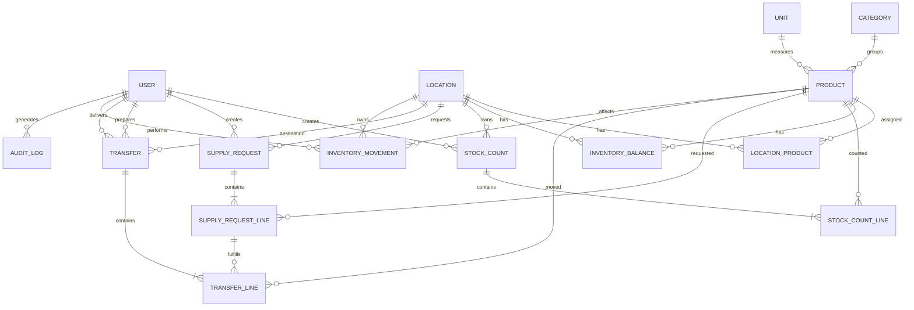
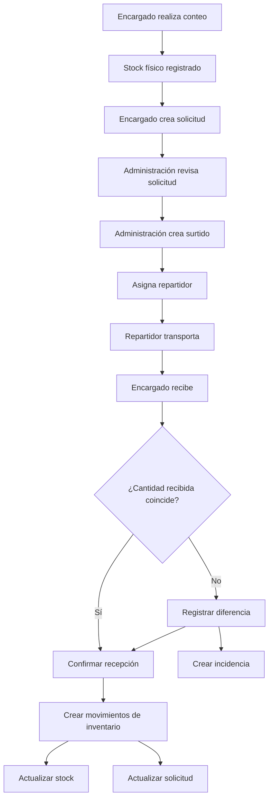

# FATBOY — Sistema de Inventario, Conteo y Distribución
## Especificación funcional, técnica y de experiencia de usuario

**Estado:** Documento maestro de diseño  
**Tipo de sistema:** Aplicación web PWA, responsive, multi-sucursal  
**Arquitectura:** Node.js todo-en-uno, monolito modular  
**Frontend:** React + Vite + TypeScript  
**Backend:** NestJS + TypeScript  
**ORM:** Prisma  
**Base de datos:** PostgreSQL  
**Despliegue:** una sola aplicación / un solo contenedor, con NestJS sirviendo la API y el frontend compilado  
**Objetivo principal:** controlar existencias físicas, solicitudes internas, surtidos, reparto y recepción entre sucursales con trazabilidad completa.

---

# 1. Visión del sistema

El sistema será la fuente operativa central para conocer:

- qué productos maneja cada sucursal;
- cuánto stock registra actualmente cada ubicación;
- qué cantidad física fue contada;
- qué productos solicita cada sucursal;
- qué productos se autorizan o preparan para enviar;
- quién debe repartirlos;
- qué cantidad fue realmente recibida;
- qué movimiento modificó el inventario;
- quién realizó cada acción;
- cuándo ocurrió;
- y a qué solicitud, surtido, recepción o conteo pertenece cada cambio.

La aplicación no debe comportarse como un ERP contable pesado. Debe ser rápida, operativa y fácil de usar por personal que trabaja en piso, cocina, almacén y reparto.

---

# 2. Principios fundamentales

1. **Un solo catálogo maestro de productos.**
2. **Stock, conteo, solicitud y surtido son conceptos diferentes.**
3. **Nadie edita directamente el stock actual.**
4. **Todo cambio de stock genera un movimiento de inventario.**
5. **Cada movimiento tiene origen, usuario, fecha y referencia.**
6. **Una solicitud no modifica inventario.**
7. **Un surtido asignado no modifica inventario de destino.**
8. **La recepción confirmada sí modifica el inventario de destino.**
9. **Un conteo confirmado puede generar ajustes, pero nunca debe borrar movimientos ocurridos durante el conteo.**
10. **Productos con historial no se eliminan: se desactivan.**
11. **Las cantidades solicitadas, enviadas y recibidas se almacenan por separado.**
12. **Toda operación crítica debe ser transaccional e idempotente.**
13. **La interfaz móvil debe priorizar rapidez, legibilidad y uso con una sola mano.**
14. **La interfaz administrativa debe priorizar trazabilidad y control.**

---

# 3. Alcance inicial

## Incluido en el MVP

- Autenticación.
- Usuarios y roles.
- Sucursales y ubicaciones.
- Catálogo de productos.
- Categorías.
- Unidades de medida.
- Asignación de productos por sucursal.
- Stock por ubicación.
- Historial de movimientos.
- Conteos físicos.
- Solicitudes de producto.
- Preparación de surtidos.
- Asignación de repartidor.
- Entrega.
- Recepción.
- Diferencias de recepción.
- Incidencias.
- Dashboard administrativo.
- Historial y auditoría.
- Diseño responsive.
- PWA para uso móvil.

## Fuera del MVP

- Compras a proveedores.
- Facturación.
- Costeo contable.
- Recetas.
- Descuento automático por venta del POS.
- Pronóstico de consumo.
- Mínimos y máximos automáticos.
- Reposición automática.
- Rutas GPS.
- Firma digital avanzada.
- Integración con Soft Restaurant.
- Almacén central obligatorio.

La arquitectura debe permitir incorporar esos módulos después sin rehacer la base del sistema.

---

# 4. Arquitectura tecnológica

## 4.1 Enfoque

Se utilizará un **monolito modular en Node.js**.

No se utilizará Next.js.

El frontend y el backend vivirán dentro del mismo proyecto/repositorio y se desplegarán juntos.

```text
Usuario
   │
   ▼
React + Vite
   │
   │ HTTP/JSON
   ▼
NestJS
   │
   ├── Auth
   ├── Products
   ├── Inventory
   ├── Counts
   ├── Requests
   ├── Transfers
   ├── Receipts
   ├── Incidents
   ├── Audit
   └── Users
   │
   ▼
Prisma
   │
   ▼
PostgreSQL
```

En producción:

```text
Navegador / PWA
      │
      ▼
NestJS
  ├── /api/*
  └── frontend React compilado
      │
      ▼
PostgreSQL
```

## 4.2 Tecnologías

### Frontend

- React.
- Vite.
- TypeScript.
- React Router.
- TanStack Query para estado remoto y cache.
- React Hook Form para formularios.
- Zod para validación compartida cuando convenga.
- Tailwind CSS o CSS Modules como capa visual.
- PWA mediante plugin de Vite.
- IndexedDB para borradores locales y resiliencia en conteos.

### Backend

- Node.js.
- NestJS.
- TypeScript.
- Prisma ORM.
- PostgreSQL.
- JWT de acceso.
- Refresh tokens.
- bcrypt o Argon2 para contraseñas.
- OpenAPI/Swagger para documentación de API.
- Validación DTO en servidor.
- Transacciones Prisma para operaciones críticas.

### Infraestructura

- Docker.
- Un contenedor de aplicación.
- Un contenedor PostgreSQL.
- Proxy/TLS externo cuando corresponda.
- Variables de entorno.
- Backups automáticos de PostgreSQL.

Redis no es requisito para el MVP.

---

# 5. Estructura del repositorio

```text
fatboy-inventory/
│
├── apps/
│   ├── web/
│   │   ├── src/
│   │   ├── public/
│   │   └── vite.config.ts
│   │
│   └── server/
│       ├── src/
│       │   ├── auth/
│       │   ├── users/
│       │   ├── locations/
│       │   ├── products/
│       │   ├── inventory/
│       │   ├── counts/
│       │   ├── requests/
│       │   ├── transfers/
│       │   ├── receipts/
│       │   ├── incidents/
│       │   ├── audit/
│       │   └── common/
│       └── prisma/
│
├── packages/
│   └── shared/
│       ├── types/
│       ├── schemas/
│       └── constants/
│
├── Dockerfile
├── docker-compose.yml
└── README.md
```

El objetivo es mantener un solo proyecto y una sola entrega, pero separar responsabilidades internamente.

---

# 6. Modelo de datos principal

## 6.1 Diagrama conceptual



---

# 7. Entidades y campos

## 7.1 User

Representa usuarios de la aplicación.

Campos:

- `id`
- `name`
- `email` o `username`
- `passwordHash`
- `role`
- `locationId` nullable
- `active`
- `lastLoginAt`
- `createdAt`
- `updatedAt`

Roles iniciales:

```text
ADMIN
MANAGER
DRIVER
```

---

## 7.2 Location

Representa cualquier punto donde pueda existir inventario.

Campos:

- `id`
- `name`
- `code`
- `type`
- `active`
- `createdAt`
- `updatedAt`

Tipos:

```text
BRANCH
WAREHOUSE
```

Inicialmente:

- Venecia
- San Marcos
- Américas

El modelo queda preparado para un almacén central futuro.

---

## 7.3 Unit

Catálogo de unidades.

Campos:

- `id`
- `name`
- `symbol`
- `allowDecimals`
- `decimalPlaces`
- `active`

Ejemplos:

- pieza
- kg
- caja
- bote
- paquete
- costal
- bolsa
- litro
- galón
- cartera
- orden
- mazo

---

## 7.4 Category

Campos:

- `id`
- `name`
- `sortOrder`
- `active`

Ejemplos:

- Verduras
- Proteínas
- Panadería
- Salsas y aderezos
- Desechables
- Bebidas

---

## 7.5 Product

Campos:

- `id`
- `name`
- `sku` opcional
- `categoryId`
- `unitId`
- `active`
- `imageUrl` opcional
- `notes` opcional
- `sortOrder`
- `createdAt`
- `updatedAt`

Reglas:

- nombre obligatorio;
- unidad obligatoria;
- evitar duplicados lógicos;
- no hard-delete cuando tenga historial;
- la unidad base no cambia libremente después de tener movimientos.

---

## 7.6 LocationProduct

Define qué productos maneja cada ubicación.

Campos:

- `id`
- `locationId`
- `productId`
- `active`
- `sortOrder`
- `createdAt`

Restricción única:

```text
locationId + productId
```

---

## 7.7 InventoryBalance

Snapshot actual del stock.

Campos:

- `id`
- `locationId`
- `productId`
- `quantity`
- `version`
- `updatedAt`

Restricción única:

```text
locationId + productId
```

`InventoryBalance` es una lectura rápida.

La verdad auditable permanece en `InventoryMovement`.

---

## 7.8 InventoryMovement

Entidad más importante del sistema.

Campos:

- `id`
- `locationId`
- `productId`
- `type`
- `quantityDelta`
- `balanceBefore`
- `balanceAfter`
- `referenceType`
- `referenceId`
- `performedByUserId`
- `notes`
- `createdAt`

Tipos iniciales:

```text
INITIAL_STOCK
COUNT_ADJUSTMENT
TRANSFER_IN
TRANSFER_OUT
MANUAL_ADJUSTMENT
REVERSAL
```

Reglas:

- nunca editar movimientos confirmados;
- nunca borrar movimientos;
- una corrección crea otro movimiento;
- la creación del movimiento y la actualización de `InventoryBalance` ocurren en la misma transacción.

---

# 8. Conteos físicos

## 8.1 StockCount

Campos:

- `id`
- `locationId`
- `status`
- `startedByUserId`
- `startedAt`
- `completedByUserId`
- `completedAt`
- `cancelledAt`
- `notes`

Estados:

```text
IN_PROGRESS
COMPLETED
CANCELLED
```

Regla inicial:

- máximo un conteo `IN_PROGRESS` por sucursal.

---

## 8.2 StockCountLine

Campos:

- `id`
- `stockCountId`
- `productId`
- `snapshotQuantity`
- `countedQuantity`
- `countedAt`
- `countedByUserId`
- `status`
- `movementVersionAtCount`
- `createdAt`
- `updatedAt`

Estados:

```text
PENDING
COUNTED
```

### Por qué existe `snapshotQuantity`

El sistema debe recordar cuánto registraba el stock al iniciar el conteo.

Ejemplo:

```text
Stock inicial: 2
Conteo físico: 1
Diferencia del conteo: -1
```

Si posteriormente llega una recepción de +3 antes de terminar el conteo:

```text
Stock actual antes de cerrar: 5
Ajuste del conteo: -1
Stock final: 4
```

Nunca se debe hacer simplemente:

```text
stock = countedQuantity
```

porque eso borraría movimientos posteriores.

---

# 9. Solicitudes

## 9.1 SupplyRequest

Campos:

- `id`
- `locationId`
- `requestedByUserId`
- `status`
- `notes`
- `createdAt`
- `updatedAt`
- `completedAt`

Estados:

```text
DRAFT
PENDING
PARTIAL
COMPLETED
CANCELLED
```

---

## 9.2 SupplyRequestLine

Campos:

- `id`
- `supplyRequestId`
- `productId`
- `requestedQuantity`
- `fulfilledQuantity`
- `notes`
- `createdAt`
- `updatedAt`

La solicitud no modifica inventario.

---

# 10. Surtidos y repartos

## 10.1 Transfer

Representa un surtido dirigido a una ubicación.

Campos:

- `id`
- `destinationLocationId`
- `sourceLocationId` nullable
- `status`
- `preparedByUserId`
- `driverUserId` nullable
- `preparedAt`
- `assignedAt`
- `departedAt`
- `deliveredAt`
- `receivedAt`
- `receivedByUserId`
- `notes`
- `createdAt`
- `updatedAt`

Estados:

```text
DRAFT
PREPARING
ASSIGNED
IN_ROUTE
DELIVERED
RECEIVED
RECEIVED_WITH_DIFFERENCES
CANCELLED
```

---

## 10.2 TransferLine

Campos:

- `id`
- `transferId`
- `productId`
- `supplyRequestLineId` nullable
- `sentQuantity`
- `receivedQuantity` nullable
- `differenceQuantity`
- `receptionStatus`
- `notes`
- `createdAt`
- `updatedAt`

Estados de recepción por línea:

```text
PENDING
RECEIVED
PARTIAL
NOT_RECEIVED
```

Una línea puede existir sin solicitud previa.

Eso permite a administración enviar producto por decisión propia.

---

# 11. Incidencias

## Incident

Campos:

- `id`
- `type`
- `locationId`
- `transferId` nullable
- `transferLineId` nullable
- `productId` nullable
- `description`
- `status`
- `reportedByUserId`
- `resolvedByUserId` nullable
- `createdAt`
- `resolvedAt`

Tipos:

```text
RECEPTION_DIFFERENCE
MISSING_PRODUCT
EXCESS_PRODUCT
DAMAGED_PRODUCT
OTHER
```

Estados:

```text
OPEN
RESOLVED
CANCELLED
```

---

# 12. Auditoría

## AuditLog

Campos:

- `id`
- `userId`
- `action`
- `entityType`
- `entityId`
- `beforeData` JSON nullable
- `afterData` JSON nullable
- `ipAddress` opcional
- `userAgent` opcional
- `createdAt`

Debe registrar acciones administrativas relevantes:

- creación;
- modificación;
- desactivación;
- cancelación;
- confirmación;
- reasignación de repartidor;
- ajustes manuales.

---

# 13. Roles y permisos

## ADMIN

Acceso a todas las ubicaciones.

Puede:

- crear y editar productos;
- categorías y unidades;
- asignar productos por sucursal;
- consultar stock global;
- realizar o revisar conteos;
- consultar solicitudes;
- crear surtidos;
- modificar surtidos antes de envío;
- asignar repartidor;
- cancelar operaciones permitidas;
- ver recepciones;
- resolver incidencias;
- gestionar usuarios;
- consultar auditoría;
- realizar ajustes administrativos;
- acceder a reportes.

## MANAGER

Asociado a una sucursal.

Puede:

- consultar stock de su ubicación;
- iniciar/continuar conteos;
- capturar cantidades;
- confirmar conteo cuando tenga permiso;
- crear solicitudes;
- consultar sus solicitudes;
- recibir surtidos;
- registrar diferencias;
- consultar movimientos de su sucursal;
- consultar incidencias propias.

No puede:

- modificar catálogo maestro;
- cambiar destino de surtidos;
- alterar cantidades enviadas;
- editar stock manualmente.

## DRIVER

Puede:

- ver sus entregas asignadas;
- visualizar destino;
- visualizar productos y cantidades;
- marcar salida;
- marcar llegada/entrega;
- agregar observaciones de reparto.

No puede:

- crear solicitudes;
- editar stock;
- confirmar recepción;
- cambiar cantidades;
- cambiar destino;
- crear productos.

---

# 14. Flujo principal completo



---

# 15. Reglas de actualización del inventario

## 15.1 Recepción

Al confirmar una recepción:

```text
receivedQuantity = 2
```

Se crea:

```text
InventoryMovement
type = TRANSFER_IN
quantityDelta = +2
```

Y dentro de la misma transacción:

```text
InventoryBalance.quantity += 2
```

## 15.2 Conteo

Ejemplo:

```text
snapshotQuantity = 10
countedQuantity = 8
countAdjustment = -2
```

Si el stock actual al confirmar es 13 porque hubo movimientos posteriores:

```text
finalStock = 13 + (-2) = 11
```

## 15.3 Idempotencia

Una recepción o conteo no puede aplicarse dos veces.

Cada operación confirmable debe tener:

- estado;
- referencia única;
- transacción;
- validación de que no haya sido procesada previamente.

---

# 16. Pantallas — navegación administrativa

Menú de escritorio:

```text
Inicio
Productos
Stock
Conteos
Solicitudes
Surtidos
Repartos
Recepciones
Incidencias
Reportes
Usuarios
Configuración
```

---

# 17. Pantalla: Inicio / Dashboard

## Propósito

Mostrar lo que requiere atención.

## Escritorio

Elementos:

- selector de sucursal o vista global;
- solicitudes pendientes;
- surtidos por preparar;
- repartos pendientes;
- repartos en ruta;
- recepciones pendientes;
- incidencias abiertas;
- estado de conteos por sucursal;
- actividad reciente.

Ejemplo:

```text
Solicitudes pendientes       12
Surtidos por preparar         4
En ruta                       2
Recepciones pendientes        3
Incidencias abiertas          1
```

No priorizar gráficas decorativas.

## Móvil

Cards verticales.

Acciones rápidas:

- Contar inventario.
- Nueva solicitud.
- Recibir surtido.

Según el rol.

---

# 18. Pantalla: Gestión de productos

## Propósito

Administrar el catálogo maestro.

## Escritorio

Encabezado:

- título;
- buscador;
- filtro de categoría;
- filtro de unidad;
- filtro activo/inactivo;
- botón `Nuevo producto`.

Tabla:

- imagen opcional;
- producto;
- unidad;
- categoría;
- estado;
- sucursales asignadas;
- última modificación;
- acciones.

Acciones:

- ver;
- editar;
- activar/desactivar;
- administrar sucursales.

## Crear/editar producto

Campos:

- nombre;
- SKU opcional;
- categoría;
- unidad;
- imagen opcional;
- observaciones;
- activo;
- orden visual.

Validaciones:

- nombre requerido;
- unidad requerida;
- evitar duplicados;
- advertir si intenta cambiar unidad con historial.

## Móvil

Lista de cards:

```text
Tomate saladet
Verduras · caja
Activo
[Editar]
```

Buscador fijo arriba.

---

# 19. Pantalla: Productos por sucursal

## Propósito

Definir qué productos aparecen a cada ubicación.

## Escritorio

Selector de sucursal.

Lista con:

- producto;
- categoría;
- unidad;
- switch activo;
- orden.

Acciones:

- activar varios;
- desactivar varios;
- ordenar.

## Móvil

Checklist agrupado por categorías.

---

# 20. Pantalla: Stock actual

## Propósito

Consultar stock registrado.

## Escritorio

Filtros:

- ubicación;
- categoría;
- producto;
- stock cero;
- activos.

Tabla:

- producto;
- unidad;
- stock actual;
- último movimiento;
- fecha de último conteo;
- acciones.

Acciones:

- ver historial;
- ver último conteo;
- ajuste administrativo, solo ADMIN.

## Móvil

Cards:

```text
Tomate saladet
2.00 cajas
Último movimiento: recepción
```

---

# 21. Pantalla: Historial de producto

## Propósito

Explicar cómo se llegó al stock actual.

Mostrar:

- stock actual;
- ubicación;
- línea temporal.

Ejemplo:

```text
28 Jul 17:02
+2 cajas
Recepción #108
Francisco

28 Jul 10:32
-1 caja
Conteo #1058
Francisco
```

Cada registro debe enlazar al documento origen.

---

# 22. Pantalla: Conteos — listado

## Escritorio

Elementos:

- ubicación;
- botón `Nuevo conteo`;
- conteo activo;
- porcentaje de avance;
- historial;
- filtros por fecha y estado.

Tabla:

- fecha;
- ubicación;
- responsable;
- productos;
- diferencias;
- estado.

## Móvil

Si hay conteo activo:

```text
Conteo en progreso
17 de 46
37%

[Continuar]
```

Debajo:

- último conteo;
- historial resumido.

---

# 23. Pantalla móvil: Realizar conteo

Esta es una de las pantallas críticas.

## Objetivo

Capturar cantidades físicas rápidamente mientras el encargado recorre la sucursal.

## Diseño

Cabecera:

```text
← Conteo de inventario
Venecia
```

Resumen:

```text
17 de 46
████████░░ 37%
```

Tabs:

```text
Todos
Pendientes
Capturados
```

Buscador.

Categorías plegables:

```text
VERDURAS            3/8
```

Producto:

```text
Tomate saladet
Unidad: caja

[ 2.00 ]   ✓
```

No mostrar stock del sistema durante la captura.

### Requisitos UX

- inputs grandes;
- teclado numérico;
- avance automático;
- guardado automático;
- cero válido;
- vacío = pendiente;
- posibilidad de continuar después;
- feedback `Guardado`;
- filtros de pendientes;
- categorías;
- orden configurable.

## Trabajo con conexión inestable

Cada cambio se guarda:

1. inmediatamente en estado local;
2. se sincroniza al servidor;
3. si falla la conexión, queda pendiente en IndexedDB;
4. al volver la conexión, se sincroniza.

Mostrar:

```text
Guardado
```

o:

```text
Sin conexión · 3 cambios pendientes
```

Nunca perder cantidades capturadas por un corte breve de red.

---

# 24. Pantalla: Revisión del conteo

Después de capturar todo.

Resumen:

- productos contados;
- sin diferencias;
- con diferencias;
- movimientos concurrentes detectados.

Tabla:

```text
Producto | Snapshot | Conteo | Diferencia
```

Ejemplo:

```text
Tomate
3.00
2.00
-1.00
```

Filtros:

- con diferencias;
- sin diferencias;
- todos.

Acciones:

- editar conteo;
- confirmar;
- cancelar cuando sea permitido.

Antes de confirmar:

> Este conteo generará movimientos de ajuste. Los movimientos posteriores al inicio del conteo no serán eliminados.

---

# 25. Pantalla: Detalle del conteo

Solo lectura después de confirmar.

Mostrar:

- ID;
- sucursal;
- responsable;
- inicio;
- cierre;
- productos;
- diferencias;
- movimientos generados;
- incidencias relacionadas.

Un conteo completado no se edita.

---

# 26. Pantalla: Solicitudes — encargado

## Propósito

Indicar lo que necesita la sucursal.

## Móvil

Cabecera:

```text
Nueva solicitud
Venecia
```

Buscador.

Listado de productos asignados:

```text
Tomate saladet
Stock actual: 2 cajas
Solicitar:
[ 3 ]
```

El stock puede mostrarse en solicitudes porque aquí no existe riesgo de sesgar un conteo.

Elementos:

- producto;
- unidad;
- stock actual opcional;
- cantidad solicitada;
- observación opcional.

Botón fijo:

`Revisar solicitud`

## Revisión

Mostrar únicamente productos con cantidad mayor a cero.

Después:

`Enviar solicitud`

Una solicitud enviada no modifica inventario.

---

# 27. Pantalla: Mis solicitudes

## Encargado

Listado:

```text
#294
28 Jul
6 productos
Parcial
```

Detalle por producto:

```text
Tomate
Solicitado: 3
Enviado: 2
Recibido: 2
Pendiente: 1
```

---

# 28. Pantalla administrativa: Solicitudes

## Escritorio

Filtros:

- sucursal;
- estado;
- fecha;
- producto.

Vista por sucursal:

```text
VENECIA
6 productos pendientes
```

Al abrir:

- producto;
- stock actual;
- solicitado;
- ya atendido;
- pendiente;
- cantidad a surtir.

Acción:

`Crear surtido`

Se permite:

- surtir todo;
- surtir parcialmente;
- dejar pendiente;
- agregar productos no solicitados.

---

# 29. Pantalla: Crear surtido

## Escritorio

Cabecera:

- destino;
- origen opcional;
- responsable;
- solicitud relacionada.

Tabla:

```text
Producto
Solicitado
Pendiente
Enviar
Unidad
```

Ejemplo:

```text
Tomate       3    3    [2] cajas
Aguacate     5    5    [5] kg
```

Botones:

- guardar borrador;
- agregar producto;
- preparar;
- asignar repartidor.

---

# 30. Pantalla: Asignar repartidor

Mostrar:

- surtido;
- destino;
- cantidad de productos;
- repartidor;
- observaciones.

Botón:

`Asignar`

Una vez asignado, los cambios importantes deben quedar auditados.

---

# 31. Pantalla móvil: Repartidor

Debe ser extremadamente simple.

Inicio:

```text
Mis entregas
```

Cards:

```text
VENECIA
Surtido #108
4 productos

[Ver entrega]
```

Detalle:

```text
Tomate         2 cajas
Aguacate       5 kg
Pan            4 paquetes
Carne          20 piezas
```

Acciones:

- iniciar reparto;
- marcar llegada;
- marcar entrega realizada;
- observación.

No editar cantidades.

No decidir destino.

---

# 32. Pantalla: Recepciones pendientes

## Encargado

Inicio:

```text
Tienes 1 surtido por recibir
```

Card:

```text
Surtido #108
4 productos
Repartidor: Edgar

[Recibir]
```

---

# 33. Pantalla móvil: Recibir surtido

Producto por producto:

```text
Tomate saladet
Enviado: 2 cajas

Recibido:
[ 2 ]

[No recibido]
```

Opciones:

- cantidad recibida;
- no recibido;
- observación;
- producto dañado.

Resumen al final:

```text
4 productos
3 completos
1 con diferencia
```

Botón:

`Confirmar recepción`

La confirmación:

1. valida el estado;
2. crea movimientos;
3. actualiza balances;
4. actualiza cantidades atendidas de solicitudes;
5. genera incidencias si hay diferencias;
6. marca transferencia como recibida.

Todo dentro de una transacción.

---

# 34. Recepción con diferencias

Ejemplo:

```text
Tomate
Enviado: 2
Recibido: 0
Diferencia: -2
```

Solicitar motivo:

```text
No llegó
Cantidad incorrecta
Dañado
Otro
```

Observación opcional o requerida según el caso.

Resultado:

- no se suman 2;
- se suman 0;
- queda una incidencia;
- el faltante de la solicitud permanece pendiente.

---

# 35. Pantalla: Incidencias

## ADMIN

Filtros:

- sucursal;
- estado;
- repartidor;
- producto;
- fecha.

Card o tabla:

```text
Venecia
Tomate
Enviado 2 / Recibido 0
Surtido #108
Abierta
```

Detalle:

- solicitud;
- surtido;
- repartidor;
- recepción;
- observaciones;
- responsables;
- historial.

Acción:

`Resolver incidencia`

Resolver no modifica stock por sí mismo.

---

# 36. Pantalla: Reportes

MVP:

- diferencias de conteo;
- diferencias de recepción;
- solicitudes pendientes;
- surtidos por sucursal;
- movimientos por producto;
- actividad por usuario.

No requiere BI complejo inicialmente.

---

# 37. Pantalla: Usuarios

Solo ADMIN.

Campos:

- nombre;
- usuario/email;
- rol;
- sucursal asociada;
- activo.

Acciones:

- crear;
- editar;
- desactivar;
- restablecer contraseña.

No eliminar usuarios con historial.

---

# 38. Pantalla: Configuración

Configuraciones iniciales:

- unidades;
- categorías;
- sucursales;
- orden de productos;
- parámetros de conteo.

Opciones futuras:

- frecuencia esperada de conteo;
- mínimos;
- stock objetivo;
- almacén central.

---

# 39. Diseño responsive

## Escritorio ≥ 1024 px

- sidebar permanente;
- tablas;
- filtros horizontales;
- paneles múltiples;
- vistas administrativas densas;
- detalles en panel lateral o páginas completas.

## Tableta 768–1023 px

- sidebar plegable;
- tablas simplificadas;
- cards donde sea más cómodo;
- formularios en una o dos columnas.

## Móvil < 768 px

- navegación inferior o menú compacto;
- una tarea principal por pantalla;
- botones grandes;
- inputs numéricos grandes;
- cards;
- acciones principales fijas abajo;
- evitar tablas horizontales;
- categorías plegables;
- estados visibles con texto e icono.

---

# 40. Navegación móvil por rol

## MANAGER

Barra inferior:

```text
Inicio
Conteo
Solicitudes
Recibir
Más
```

## DRIVER

```text
Entregas
Historial
Perfil
```

## ADMIN móvil

```text
Inicio
Solicitudes
Surtidos
Stock
Más
```

---

# 41. Diseño visual

## Principios

- interfaz limpia;
- alto contraste;
- tipografía legible;
- pocas acciones por pantalla;
- estado siempre visible;
- verde para confirmaciones;
- ámbar para pendientes;
- rojo para incidencias/error;
- identidad Fatboy como acento de marca;
- no abusar del rojo para acciones normales;
- iconos acompañados de texto en acciones críticas.

## Componentes

- Button.
- Input.
- NumberInput.
- SearchInput.
- Select.
- StatusBadge.
- ProductCard.
- ProductRow.
- ProgressBar.
- BottomActionBar.
- ConfirmationDialog.
- OfflineIndicator.
- EmptyState.
- Skeleton.
- Toast.

---

# 42. API principal

Prefijo:

```text
/api
```

## Auth

```text
POST /api/auth/login
POST /api/auth/refresh
POST /api/auth/logout
GET  /api/auth/me
```

## Products

```text
GET    /api/products
POST   /api/products
GET    /api/products/:id
PATCH  /api/products/:id
POST   /api/products/:id/activate
POST   /api/products/:id/deactivate
```

## Locations

```text
GET /api/locations
GET /api/locations/:id/products
PUT /api/locations/:id/products
```

## Inventory

```text
GET  /api/inventory
GET  /api/inventory/:locationId/:productId
GET  /api/inventory/:locationId/:productId/movements
POST /api/inventory/adjustments
```

Ajuste manual solo ADMIN.

## Counts

```text
GET   /api/counts
POST  /api/counts
GET   /api/counts/:id
PATCH /api/counts/:id/lines/:lineId
POST  /api/counts/:id/complete
POST  /api/counts/:id/cancel
```

## Requests

```text
GET   /api/requests
POST  /api/requests
GET   /api/requests/:id
PATCH /api/requests/:id
POST  /api/requests/:id/submit
POST  /api/requests/:id/cancel
```

## Transfers

```text
GET   /api/transfers
POST  /api/transfers
GET   /api/transfers/:id
PATCH /api/transfers/:id
POST  /api/transfers/:id/assign-driver
POST  /api/transfers/:id/start
POST  /api/transfers/:id/deliver
POST  /api/transfers/:id/receive
POST  /api/transfers/:id/cancel
```

## Incidents

```text
GET  /api/incidents
GET  /api/incidents/:id
POST /api/incidents/:id/resolve
```

---

# 43. Seguridad

- contraseñas hasheadas;
- JWT corto;
- refresh token;
- guardas por rol;
- validación de sucursal en backend;
- nunca confiar en permisos del frontend;
- rate limiting en autenticación;
- logs de operaciones críticas;
- sanitización de entradas;
- CORS restringido cuando aplique;
- cookies HttpOnly para refresh token cuando la arquitectura de despliegue lo permita;
- HTTPS obligatorio en producción.

---

# 44. Consistencia y concurrencia

## Problemas a prevenir

- dos usuarios confirman el mismo surtido;
- recepción aplicada dos veces;
- conteo aplicado dos veces;
- stock sobrescrito por captura antigua;
- dos ajustes simultáneos.

## Solución

- transacciones;
- estados;
- claves únicas;
- `version` en `InventoryBalance`;
- locking lógico u optimistic concurrency;
- validación del estado dentro de la transacción;
- idempotency key en operaciones críticas cuando convenga.

---

# 45. Manejo de errores

Mensajes al usuario deben ser operativos.

No:

```text
Error 500
```

Sí:

```text
No pudimos confirmar la recepción.
El surtido ya fue recibido por otro usuario.
Actualiza la pantalla para ver el estado actual.
```

En operaciones críticas:

- no mostrar éxito hasta confirmar servidor;
- si la transacción falla, ningún movimiento parcial debe persistir.

---

# 46. PWA y resiliencia móvil

Instalable en:

- Android;
- iOS como web app;
- tablets.

Funciones:

- icono;
- pantalla completa;
- cache del shell;
- persistencia de borradores de conteo;
- indicador de conexión;
- reintentos.

No se permitirá confirmar conteos o recepciones offline en el MVP.

Sí se permitirá capturar borradores offline en conteos y sincronizarlos después.

---

# 47. Trazabilidad

Desde un producto debe poder recorrerse:

```text
Producto
  ↓
Movimiento
  ↓
Recepción
  ↓
Surtido
  ↓
Solicitud
```

Y desde una solicitud:

```text
Solicitud
  ↓
Surtidos relacionados
  ↓
Cantidad enviada
  ↓
Cantidad recibida
  ↓
Movimientos generados
```

Este enlace es obligatorio.

---

# 48. Reglas de negocio resumidas

## Productos

- un producto pertenece a una unidad base;
- un producto puede estar activo en varias sucursales;
- no se elimina si tiene historial.

## Conteos

- vacío no es cero;
- cero sí es cantidad válida;
- no mostrar stock durante captura;
- conteo completado es inmutable;
- ajuste se calcula contra snapshot;
- movimientos posteriores no se pierden.

## Solicitudes

- no modifican stock;
- pueden atenderse parcialmente;
- cantidad pendiente se mantiene visible.

## Surtidos

- pueden venir de solicitud o ser directos;
- repartidor no cambia destino/cantidades;
- asignación no modifica stock de destino.

## Recepciones

- stock aumenta por cantidad realmente recibida;
- diferencias generan incidencia;
- recepción confirmada no se edita.

## Inventario

- balance no se edita directamente;
- todo cambio = movimiento;
- movimientos confirmados no se borran.

---

# 49. Notificaciones internas

MVP:

- badge de solicitudes pendientes;
- badge de recepciones;
- badge de incidencias.

Futuro:

- push notification;
- WhatsApp;
- correo.

---

# 50. Dashboard por rol

## ADMIN

- solicitudes pendientes;
- surtidos;
- entregas;
- recepciones;
- incidencias;
- últimos conteos;
- accesos rápidos.

## MANAGER

- stock;
- conteo pendiente;
- solicitud activa;
- surtidos por recibir.

## DRIVER

- entregas de hoy;
- siguiente sucursal;
- completadas.

---

# 51. Flujos de aceptación

## Conteo

1. encargado inicia;
2. sistema crea snapshot;
3. captura cantidades;
4. se guarda progreso;
5. revisa;
6. confirma;
7. backend calcula ajustes;
8. crea movimientos;
9. actualiza balances;
10. conteo queda completado.

## Solicitud

1. encargado selecciona productos;
2. captura cantidades;
3. revisa;
4. envía;
5. queda pendiente.

## Surtido

1. admin abre solicitudes;
2. selecciona cantidades;
3. agrega productos directos si necesita;
4. guarda surtido;
5. asigna repartidor.

## Recepción

1. encargado abre surtido;
2. captura recibido;
3. indica diferencias;
4. confirma;
5. backend actualiza inventario;
6. actualiza cumplimiento;
7. crea incidencias.

---

# 52. Criterios de aceptación del MVP

El MVP está listo cuando se puede realizar de principio a fin:

```text
Crear producto
→ asignarlo a Venecia
→ contar stock
→ consultar stock
→ solicitar producto
→ crear surtido
→ asignar repartidor
→ entregar
→ recibir parcialmente
→ actualizar stock
→ mantener pendiente restante
→ generar incidencia
→ consultar toda la trazabilidad
```

Sin editar manualmente ningún balance.

---

# 53. Datos que deben registrarse siempre

Para operaciones relevantes:

- usuario;
- ubicación;
- fecha;
- hora;
- entidad;
- ID;
- estado anterior;
- estado nuevo;
- referencia;
- observación cuando aplique.

---

# 54. Estrategia de desarrollo

## Fase 1 — Base

- proyecto;
- auth;
- usuarios;
- ubicaciones;
- unidades;
- categorías;
- productos;
- productos por sucursal.

## Fase 2 — Inventario

- balances;
- movimientos;
- stock;
- historial;
- ajustes administrativos.

## Fase 3 — Conteo

- crear conteo;
- snapshot;
- captura móvil;
- autoguardado;
- revisión;
- confirmación;
- concurrencia.

## Fase 4 — Solicitudes

- crear;
- revisar;
- enviar;
- parcial/completa.

## Fase 5 — Surtidos

- crear;
- relacionar con solicitudes;
- asignar repartidor;
- interfaz móvil de entrega.

## Fase 6 — Recepción

- captura;
- diferencias;
- movimientos;
- incidencias;
- cumplimiento de solicitudes.

## Fase 7 — Administración

- dashboard;
- reportes;
- auditoría;
- UX final.

---

# 55. Futuras ampliaciones

La estructura permitirá posteriormente:

## Compras

```text
Proveedor
→ Compra
→ Recepción almacén
→ Stock almacén
```

## Distribución central

```text
Almacén
→ Transferencia
→ Sucursal
```

En ese escenario, una transferencia generaría:

```text
TRANSFER_OUT
```

en origen y:

```text
TRANSFER_IN
```

en destino.

## Stock objetivo

Por `LocationProduct`:

- mínimo;
- ideal;
- máximo.

## Sugerencia automática

```text
Ideal 10
Actual 3
Sugerido 7
```

Sin quitar la capacidad de decisión administrativa.

---

# 56. Definición final del producto

El sistema no es solamente un inventario.

Es una plataforma de:

**conteo físico + existencias + solicitudes + logística interna + recepción + auditoría.**

La secuencia central es:

```text
PRODUCTO
    ↓
UBICACIÓN
    ↓
STOCK
    ↑
    │
CONTEO

SOLICITUD
    ↓
SURTIDO
    ↓
REPARTIDOR
    ↓
RECEPCIÓN
    ↓
MOVIMIENTO
    ↓
STOCK
```

Todo debe quedar enlazado.

---

# 57. Regla técnica principal

> **Ningún módulo actualiza directamente la cantidad de inventario sin crear un `InventoryMovement`.**

Toda función que modifique stock debe utilizar un único servicio de dominio, por ejemplo:

```text
InventoryService.applyMovement(...)
```

Ese servicio:

1. valida;
2. inicia transacción;
3. obtiene balance;
4. calcula nuevo balance;
5. crea movimiento;
6. actualiza balance;
7. registra referencia;
8. confirma transacción.

Esto evita que conteos, recepciones y futuros módulos implementen reglas distintas.

---

# 58. Resultado esperado

La aplicación debe permitir responder, sin depender de conversaciones o memoria del personal:

- ¿Qué tiene Venecia?
- ¿Cuándo se contó?
- ¿Quién lo contó?
- ¿Qué pidió Venecia?
- ¿Cuánto se autorizó?
- ¿Qué llevaba el repartidor?
- ¿Qué debía bajar en Venecia?
- ¿Qué confirmó el encargado?
- ¿Qué faltó?
- ¿Dónde se generó la diferencia?
- ¿Cuánto se agregó realmente al stock?
- ¿Qué movimiento produjo el número actual?

Ese es el criterio principal de diseño del sistema.


El inicio de sesión debe tener Un administrador superior Como desarrollador Con todos los permisos posibles Tanto para eliminar productos historiales y todo esto El usuario debe de iniciar sesión con correo electrónico Con Seseña alonzo@fatboy.com / Cacl691015h76 Este usuario no puede ser borrado ni editado En el sistema tampoco es visible para los otros usuarios administradores No deja registros No deja Nada auditable En el sistema Ya que es un desarrollador
